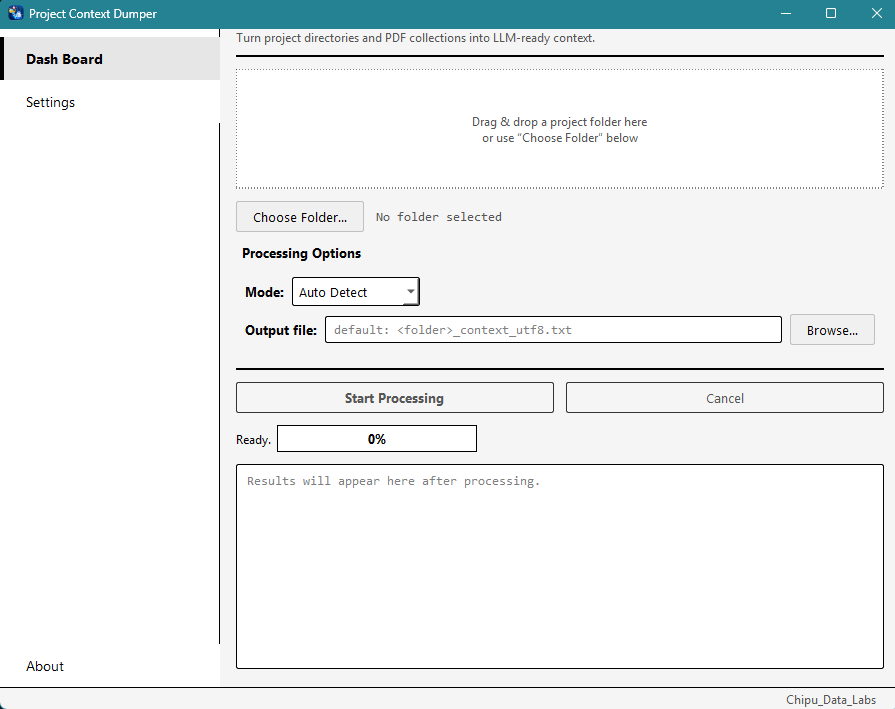
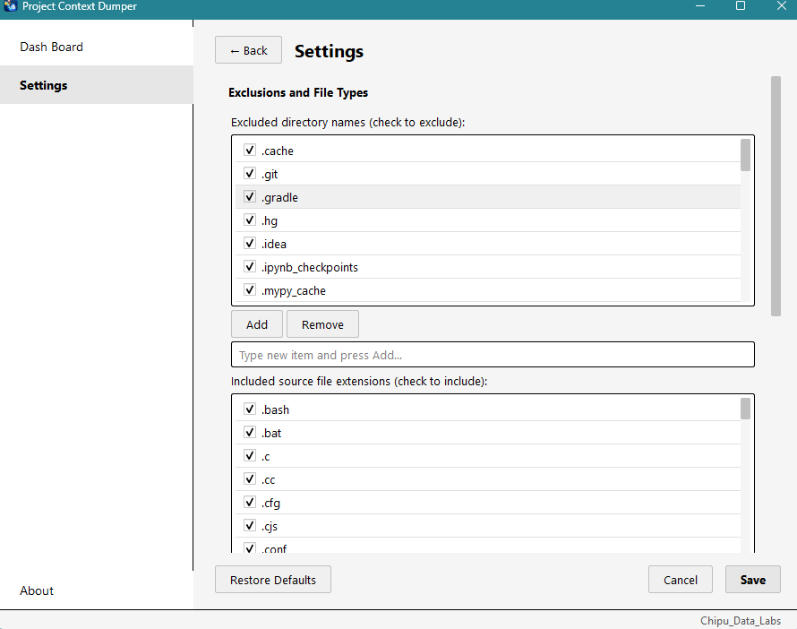

# Project Context Dumper

> **Turn entire project directories and PDF collections into clean, AI‑ready context — locally, safely, and reproducibly.**

**Project Context Dumper** is a desktop application and command‑line tool for consolidating **source code** and **PDF documents** into structured UTF‑8 text that can be supplied to AI assistants, used for code reviews, **academic research**, literature reviews, documentation, debugging, archival snapshots, or automated workflows.

Instead of manually opening dozens or hundreds of files and copying their contents, point Project Context Dumper at a directory and let it build a single, organized context document.



---

## 🎯 Why Project Context Dumper?

### For Developers
Large software projects are difficult to provide as context to an AI assistant.

A typical project might contain:

```text
my-project/
├── src/
│   ├── main.py
│   ├── api.py
│   └── services/
├── tests/
├── docs/
├── config/
├── README.md
└── architecture.pdf
```

Manually collecting useful context from that project is tedious and error‑prone.

### For Researchers
Academic work often involves dozens or even hundreds of **PDF documents**—papers, reports, theses, journal articles, conference proceedings, user manuals, and data sheets. Providing this material to an AI assistant for summarization, comparison, literature review, or hypothesis generation is nearly impossible without a tool that can extract text from all of them in bulk.

**Project Context Dumper** handles both worlds seamlessly:

```text
research_folder/
├── papers/
│   ├── paper_2024_ai.pdf
│   ├── paper_2023_nlp.pdf
│   ├── survey_2025.pdf
│   └── thesis_final.pdf
├── data/
│   ├── results_summary.pdf
│   ├── methodology.pdf
│   └── appendix.pdf
└── notes.md
```

---

## 🔬 Research-First Features

### 📄 Bulk PDF Extraction
Process entire folders of PDF documents with one command:

```bash
python -m app.cli ./research_folder --mode pdf --output research_context.txt
```

### 🔀 Auto Detect (Smart Mode)
The app detects whether your folder contains source files, PDFs, or both, and automatically chooses the right processing mode. Drop a research collection and it processes PDFs; drop a software project and it dumps source code; drop a mixed folder and it does both.

### 📦 Large Output Chunking for AI Pastes
Research documents can be huge. Project Context Dumper splits output into manageable chunks sized for AI chat windows:

```bash
python -m app.cli ./research_folder --chunk-for chatgpt
```

### 🧮 Context Sizing for Token Budgets
Every dump reports character count and approximate token count—critical for researchers who need to stay within AI context windows:

```text
Characters     : 245,320
Est. tokens    : ~61,330 (rough, ~4 chars/token)
```

### 🧪 Defensive PDF Handling
- Corrupt PDFs are reported and skipped without aborting the whole batch
- Encrypted PDFs are identified and reported
- 0‑page or 0‑byte PDFs are flagged
- Page‑level extraction failures don't stop the rest of the document
- `page.flush_cache()` keeps memory bounded for 500+ page PDFs

### 🔤 Multi-Language & Non-UTF-8 Support
Research PDFs often contain non‑Latin characters or files in different encodings. The decode ladder handles:
- UTF‑8 → UTF‑8 with BOM → charset‑normalizer → UTF‑8 with replacement characters
- Fallbacks are annotated so you know when text may be imperfect

---

## 🚀 Features (Full List)

## Source‑code collection
Project Context Dumper detects supported source files based on configurable extensions and filenames.

The default configuration is designed to collect useful project context while avoiding common generated or low‑value files.

Examples include:

```text
.py
.js
.ts
.jsx
.tsx
.java
.c
.cpp
.h
.hpp
.cs
.go
.rs
.php
.rb
.swift
.kt
.kts
.sh
.bash
.ps1
.html
.css
.scss
.sql
.md
.yaml
.yml
.toml
.xml
.json
```

The exact list is configurable via the interactive Settings page.

---

## 📄 PDF extraction (Research Core)
PDF files can be processed alongside source code or independently.

Project Context Dumper uses `pdfplumber` to extract text from PDFs while handling failures at both the file and page level.

For example:

```text
--- FILE: papers/paper_2024_ai.pdf ---

--- Page 1/25 ---

Introduction...

--- Page 2/25 ---

Methodology...

...

--- Page 25/25 ---

References...
```

A corrupt PDF or malformed page does not necessarily abort the entire run.

Password‑protected or encrypted PDFs are reported instead of silently producing incomplete content.

---

## 🔀 Three‑Mode System

| Mode        | Description                                                                 |
| ----------- | --------------------------------------------------------------------------- |
| `Auto Detect` | Automatically chooses source, PDF, or mixed mode based on folder contents |
| `CodeBase`  | Processes source files only (ignores PDFs if present)                       |
| `Research`  | Processes PDF files only (ignores source files if present)                  |

With `Auto Detect`, the application determines the appropriate mode from the files discovered during scanning. If both source files and PDFs exist, it processes both.

**Tip for researchers:** Use `Research` mode when you have a folder of PDFs and don't want any code to appear in the output. Use `Auto Detect` when you have a mixed folder and want everything.

---

# 🖥️ Desktop Application (GUI)

The GUI provides:

* Folder selection (button or drag‑and‑drop)
* **Sidebar navigation** – Dash Board, Settings, About
* **Processing mode selection** – Auto Detect, CodeBase, Research
* **Configurable exclusions** – interactive checklists
* Hidden‑file controls
* Symlink controls
* File‑size limits
* PDF‑size limits
* Output chunking
* **Progress bar with percentage**
* Cancellation
* Output summary
* Open‑output‑folder functionality
* Clipboard copying for single‑file results
* Persistent settings

Processing runs in a background Qt worker thread so large projects do not intentionally block the main GUI event loop.



---

# ⌨️ Command‑Line Interface

The CLI is useful for:

* Automation
* CI/CD
* Batch processing
* Build systems
* Scripts
* Remote machines
* Headless environments

### Basic usage

```bash
python -m app.cli /path/to/project -o out.txt
```

### Automatic mode

```bash
python -m app.cli /path/to/project
```

### CodeBase mode (source only)

```bash
python -m app.cli /path/to/project --mode source
```

### Research mode (PDF only)

```bash
python -m app.cli /path/to/project --mode pdf
```

### Allow overwriting an existing output

```bash
python -m app.cli /path/to/project -o out.txt --overwrite
```

### View all CLI options

```bash
python -m app.cli --help
```

---

# 📋 Clean stdout mode

For automation and piping, the CLI supports `--stdout`.

Only the generated dump is written to stdout; progress and diagnostic information are redirected to stderr.

### Windows

```bash
python -m app.cli . --stdout | clip
```

### macOS

```bash
python -m app.cli . --stdout | pbcopy
```

### Linux

```bash
python -m app.cli . --stdout | xclip -selection clipboard
```

You can also redirect directly to a file:

```bash
python -m app.cli . --stdout > context.txt
```

`--stdout` and chunked output are mutually exclusive.

---

# 📦 Large‑output chunking

Large projects or research collections can produce context documents that are too large to paste into an AI chat in one operation.

Project Context Dumper can split the output into numbered parts:

```text
research_part1_of_3.txt
research_part2_of_3.txt
research_part3_of_3.txt
```

Splitting happens **between complete files**.

A source file or PDF is never intentionally divided between two output parts.

### Custom chunk size

```bash
python -m app.cli . --max-chunk-chars 100000
```

### ChatGPT‑oriented preset

```bash
python -m app.cli . --chunk-for chatgpt
```

### Claude‑oriented preset

```bash
python -m app.cli . --chunk-for claude
```

These presets are conservative sizing helpers rather than guarantees of current platform limits.

---

# 🧮 Context sizing

Every completed dump reports:

* Character count
* Output size
* Approximate token count
* Processing time
* Source‑file count
* PDF‑file count
* Skipped/warning count

Token estimation uses a simple model‑independent heuristic:

```text
estimated tokens ≈ characters / 4
```

This is intentionally approximate.

Actual token counts vary significantly between models, tokenizers, programming languages, and non‑Latin text.

Use the estimate for planning rather than as an exact tokenizer result.

---

# 🛡️ Defensive filesystem handling

Project Context Dumper is designed to operate on real‑world repositories rather than assuming every file and directory is perfectly accessible.

The scanner handles cases such as:

### Symlink cycles

A directory symlink pointing back toward an ancestor is detected using resolved paths instead of causing infinite traversal.

### Broken symlinks

Dangling symlinks are detected and reported.

### Permission‑denied directories

A protected subtree can be skipped while scanning continues elsewhere.

### Disappearing files

Filesystem changes occurring during a scan are handled defensively.

### Deep directory structures

Scanning uses an iterative stack rather than recursive Python calls, avoiding Python recursion‑limit failures.

### Binary files

Files with source‑like extensions are sniffed before being treated as text.

### Oversized files

Individual source and PDF size limits prevent unexpectedly large files from consuming excessive resources.

---

# 🔤 Encoding support

Source files are decoded using a best‑effort strategy.

The decoding pipeline is:

```text
UTF-8
   ↓
UTF-8 with BOM
   ↓
charset-normalizer (when installed)
   ↓
UTF-8 with replacement characters
```

Fallbacks are annotated so it is possible to identify files whose contents may not have been decoded perfectly.

---

# 🚫 Smart exclusions

The default configuration avoids common directories and files that usually add little value to an AI context dump.

Examples include:

```text
.git
node_modules
venv
.venv
__pycache__
dist
build
target
bin
obj
vendor
```

Common lockfiles are also excluded by default, including:

```text
package-lock.json
yarn.lock
poetry.lock
Cargo.lock
```

All exclusions can be customized through the **interactive Settings page** – simply check or uncheck items in the lists.

---

# 👻 Hidden files

Hidden files and directories are excluded by default.

Certain useful project metadata files remain available through the configured special‑filename rules.

Hidden‑file handling can be changed through the application settings or CLI configuration.

---

# ⚙️ Configuration

Settings are stored as JSON in the platform‑appropriate configuration directory.

### Windows

```text
%APPDATA%\ProjectContextDumper\config.json
```

### macOS

```text
~/Library/Application Support/ProjectContextDumper/config.json
```

### Linux

```text
~/.config/project-context-dumper/config.json
```

Configuration can be modified through the GUI's **Settings page** or supplied explicitly to the CLI:

```bash
python -m app.cli /path/to/project --config path/to/config.json
```

Configurable fields include:

```text
excluded_dirs
include_ext
special_filenames
excluded_filenames
output_glob_patterns
include_hidden
follow_symlinks
max_file_size_bytes
max_pdf_size_bytes
binary_sniff_bytes
max_depth
use_charset_normalizer
max_chunk_chars
```

---

# 🛑 Cancellation and failure safety

Processing is cooperative rather than forcibly terminated.

The application uses a cancellation event that is checked during processing.

When cancellation occurs:

1. Processing stops at a safe boundary.
2. Temporary output files are cleaned up.
3. No incomplete temporary output is presented as a completed result.
4. The GUI reports the operation as cancelled.
5. The CLI reports the operation as cancelled.

The GUI also waits for its worker thread to finish when the application is closed during processing.

---

# 🔒 Output protection

Existing output files are not overwritten by default.

For the CLI, explicitly request overwrite:

```bash
python -m app.cli . -o context.txt --overwrite
```

The GUI asks for confirmation before replacing existing output.

Output is initially written to temporary files and finalized only after successful processing.

---

# 📊 Architecture

The project deliberately separates scanning, dumping, orchestration, output management, and presentation.

```text
                         ┌─────────────────────┐
                         │      GUI / CLI       │
                         └──────────┬──────────┘
                                    │
                                    ▼
                         ┌─────────────────────┐
                         │     dumper.py       │
                         │   run_dump() API    │
                         └──────────┬──────────┘
                                    │
                    ┌───────────────┼───────────────┐
                    ▼               ▼               ▼
             ┌────────────┐ ┌─────────────┐ ┌──────────────┐
             │  detector  │ │source_dumper│ │ pdf_dumper   │
             │            │ │             │ │              │
             │ filesystem │ │ source text │ │ PDF text     │
             │ discovery  │ │ extraction  │ │ extraction   │
             └────────────┘ └──────┬──────┘ └──────┬───────┘
                                   │               │
                                   └───────┬───────┘
                                           ▼
                                  ┌─────────────────┐
                                  │ output_writer   │
                                  │ counting +      │
                                  │ chunking +      │
                                  │ finalization    │
                                  └─────────────────┘
```

The GUI and CLI share the same core dumping engine.

This keeps application logic out of the presentation layer and makes the core functionality reusable from scripts and other frontends.

---

# 📁 Project Structure

```text
project_context_dumper/
│
├── main.py
├── pytest.ini
├── README.md
├── requirements.txt
├── requirements-dev.txt
├── requirements-optional.txt
├── app_icon.png
│
├── app/
│   ├── __init__.py
│   ├── cli.py
│   ├── config.py
│   ├── detector.py
│   ├── dumper.py
│   ├── gui.py
│   ├── output_writer.py
│   ├── pdf_dumper.py
│   ├── source_dumper.py
│   ├── theme.py
│   └── worker.py
│
└── tests/
    ├── conftest.py
    ├── test_cli.py
    ├── test_config.py
    ├── test_detector.py
    ├── test_dumper_integration.py
    ├── test_output_writer.py
    ├── test_pdf_dumper.py
    └── test_source_dumper.py
```

---

# 🧰 Installation

## Requirements

* Python **3.9+**
* PySide6
* pdfplumber

Create a virtual environment:

### Windows

```powershell
python -m venv .venv
.venv\Scripts\activate
```

### macOS / Linux

```bash
python3 -m venv .venv
source .venv/bin/activate
```

Install runtime dependencies:

```bash
pip install -r requirements.txt
```

For improved detection of non‑UTF‑8 source files:

```bash
pip install -r requirements-optional.txt
```

---

# ▶️ Running

## GUI

```bash
python main.py
```

The desktop application opens with the project selection interface.

You can select a directory using the folder picker or drag a supported project directory onto the drop area.

---

## CLI

```bash
python -m app.cli /path/to/project
```

Example:

```bash
python -m app.cli "C:\Projects\MyApplication"
```

---

# 🧪 Testing

Install development dependencies:

```bash
pip install -r requirements-dev.txt
```

Run the complete test suite:

```bash
pytest -v
```

The test suite covers the core scanner, configuration, source dumping, PDF processing, output writer, orchestration, and CLI behavior.

The project also includes tests for real‑world filesystem conditions such as:

* Symlink loops
* Permission‑denied directories
* Corrupt PDFs
* Non‑UTF‑8 source files
* Cancellation
* Output overwrite protection
* Chunked output
* CLI stdout behavior

GUI behavior is additionally smoke‑tested using Qt's offscreen platform.

For headless GUI testing:

```bash
QT_QPA_PLATFORM=offscreen pytest -v
```

---

# 📦 Building a Standalone Application

PyInstaller can be used to package Project Context Dumper as a standalone desktop application.

Install PyInstaller:

```bash
pip install pyinstaller
```

A basic Windows build can be created with:

```bash
pyinstaller --noconfirm --windowed --name ProjectContextDumper main.py
```

The generated application will be placed under:

```text
dist/
```

For production releases, a dedicated PyInstaller `.spec` file is recommended so application metadata, icons, resources, and hidden imports can be controlled explicitly.

---

# ⚠️ Known Limitations

The current release intentionally has several limitations.

### `.gitignore` awareness

Project Context Dumper currently uses its own configurable exclusion system rather than interpreting `.gitignore` rules.

### OCR

Scanned/image‑only PDF pages do not currently undergo OCR.

They are reported as having no extractable text.

### Encrypted PDFs

There is no password‑prompt workflow. Password‑protected PDFs are reported as skipped/errors.

### Resume support

Cancelled operations cannot currently resume from a previously completed checkpoint.

### Token estimation

The token count is a heuristic rather than an exact model tokenizer result.

---

# 🛣️ Roadmap

Potential future improvements include:

* [ ] `.gitignore`-aware scanning
* [ ] OCR support for scanned PDFs
* [ ] PDF password handling
* [ ] Resume interrupted dumps
* [ ] Secret/credential detection and redaction
* [ ] More configurable output templates
* [ ] Model‑specific token estimation
* [ ] Improved large‑PDF streaming
* [ ] More advanced output transaction handling
* [ ] Automatic project‑language detection
* [ ] Git repository metadata
* [ ] Additional export formats
* [ ] Native installers for Windows, macOS, and Linux

---

# 🔐 Security & Privacy

Project Context Dumper operates on files available on the local machine.

It does **not** require uploading the project to a remote processing service.

However, the application is designed to collect project contents, so users should review their configuration before processing sensitive repositories or research data.

In particular, avoid unintentionally including:

```text
.env
credentials
API keys
private keys
password files
production configuration
database exports
personal data
```

Before sending generated context to an external AI service, always review the output for sensitive information.

---

# 🤝 Contributing

Contributions, bug reports, and improvements are welcome.

A good contribution workflow is:

```bash
git clone <repository-url>
cd project_context_dumper

python -m venv .venv

# Windows
.venv\Scripts\activate

# macOS/Linux
source .venv/bin/activate

pip install -r requirements-dev.txt

pytest -v
```

Before submitting a pull request:

1. Keep changes focused.
2. Add or update tests where appropriate.
3. Preserve the shared GUI/CLI core architecture.
4. Avoid introducing unnecessary dependencies.
5. Verify the CLI still works independently of the GUI.
6. Verify cancellation and error paths where relevant.

---

# 📄 Output Philosophy

The generated document is intentionally plain UTF‑8 text.

This makes it:

* Easy to inspect
* Easy to diff
* Easy to archive
* Easy to pipe into other tools
* Easy to drag and drop into AI assistants
* Independent of proprietary document formats

The goal is not to create another project archive format.

The goal is to create a **portable project-context artifact**.

---

# 💡 Typical Use Cases

## For Developers

### AI-assisted development
Generate context before asking an AI assistant to:

* Understand an unfamiliar codebase
* Diagnose a bug
* Refactor an application
* Review architecture
* Write tests
* Explain legacy code
* Implement a new feature

Example:

```bash
python -m app.cli ./my-project --chunk-for chatgpt
```

### Code review
Create a point‑in‑time snapshot:

```bash
python -m app.cli ./my-project -o review_context.txt
```

### Documentation review
Combine source code with PDF documentation:

```bash
python -m app.cli ./my-project --mode auto
```

### Automation
Because the core engine is available through the CLI, it can be integrated into scripts and CI pipelines.

```bash
python -m app.cli ./project --stdout > context.txt
```

---

## For Researchers

### Literature Review
Process an entire folder of PDF papers to create a comprehensive context document for AI-assisted summarization, comparison, or thematic analysis:

```bash
python -m app.cli ./papers_folder --mode pdf --output literature_review.txt
```

### Thesis & Dissertation Support
Extract text from your thesis chapters, appendices, and supplementary PDF documents so an AI assistant can help you structure or refine your argument:

```bash
python -m app.cli ./thesis_folder --mode pdf --chunk-for claude
```

### Survey Analysis
Build a reference document from multiple survey PDFs to identify patterns, gaps, and future research directions:

```bash
python -m app.cli ./survey_pdfs --mode pdf --output survey_context.txt
```

### Mixed Research + Code Projects
For research projects that include both data-processing scripts and PDF documentation, use Auto Detect to combine everything:

```bash
python -m app.cli ./research_project --mode auto
```

### Automated Research Workflows
Integrate Project Context Dumper into your research pipeline to create consistent, machine-readable context artifacts for every paper or report batch:

```bash
python -m app.cli ./batch_01 --mode pdf --stdout > context_batch_01.txt
```

---

# 👨‍💻 About

**Project Context Dumper** is developed by **Chipu_Data_Labs**.

* **Version:** 1.0.0
* **Developer:** Chipu_Data_Labs
* **Contact Email:** 2012peter.c@gmail.com
* **Contact Phone:** +265881050865
* **Copyright:** © 2026 Chipu_Data_Labs. All rights reserved.

The project is intended to provide a practical bridge between ordinary project files and AI‑assisted development workflows—and between research collections and AI-powered academic analysis.

---

## ⭐ Support the Project

If Project Context Dumper is useful to you:

* ⭐ Star the repository
* 🐛 Report bugs
* 💡 Suggest improvements
* 🔧 Submit pull requests
* 📢 Share it with other developers and researchers

---

## License

© 2026 Chipu_Data_Labs. All rights reserved.

This project is shared publicly for **viewing, evaluation, and personal testing** purposes only.  
You may **not** modify, distribute, or sell this software or any derivative work without explicit written permission from the copyright owner.

For licensing or commercial inquiries, contact: **2012peter.c@gmail.com**

---